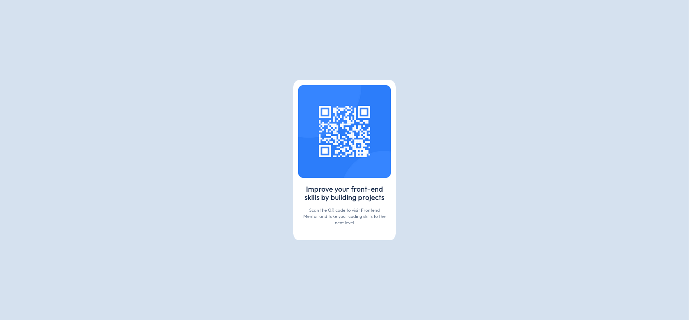

# Frontend Mentor - QR code component solution

This is a solution to the [QR code component challenge on Frontend Mentor](https://www.frontendmentor.io/challenges/qr-code-component-iux_sIO_H). Frontend Mentor challenges help you improve your coding skills by building realistic projects. 

## Table of contents

- [Overview](#overview)
  - [Screenshot](#screenshot)
  - [Links](#links)
- [My process](#my-process)
  - [Built with](#built-with)
  - [What I learned](#what-i-learned)
  - [Continued development](#continued-development)
  - [Useful resources](#useful-resources)
- [Author](#author)
- [Acknowledgments](#acknowledgments)


## Overview

### Screenshot



### Links

- Solution URL: [https://github.com/vanhog/frontend-mentor-qr-code-component](https://github.com/vanhog/frontend-mentor-qr-code-component)
- Live Site URL: [https://frontend-mentor-qr-code-element.netlify.app/](https://frontend-mentor-qr-code-element.netlify.app/)

## My process

### Built with

- Semantic HTML5 markup
- CSS custom properties

### What I learned

The QR code component was the first challenge I completed on Frontend Mentor.

- I learned that the anchor point of a box model element is its top-left corner. To center an element, it needs to be shifted back by half of its height and half of its width toward the top and left edges, respectively.

```css
.qr-container {
    width: Xpx;
    height: Ypx;
    position: absolute;
    top: 50%;
    left: 50%;
    margin-left: -X/2px;
    margin-top: -Y/2px;
    }
```
- I learned, that for every browser the **default font-size** is 16px, and that this can be used for relative units like **em** and **rem**. 

- Furthermore, I learned to use Figma.

### Continued development

Using this method does not push the following elements forward. I think it would have been better to use CSS Flexbox or CSS Grid.

### Useful resources

- [Stack overflow 982054](https://stackoverflow.com/questions/982054/how-to-center-an-element-in-the-middle-of-the-browser-window) - This helped me to figure out how to center objects using the box model's elements.

## Author

- Website - [Dieter H. Hoogestraat](https://www.hoogestraat.com)
- Frontend Mentor - [@vanhog](https://www.frontendmentor.io/profile/vanhog)

## Acknowledgments

Thanks to [PatrikAkerstrand](https://stackoverflow.com/users/101811/patrikakerstrand) who wrote that stackoverflow answere that helped me so much.
